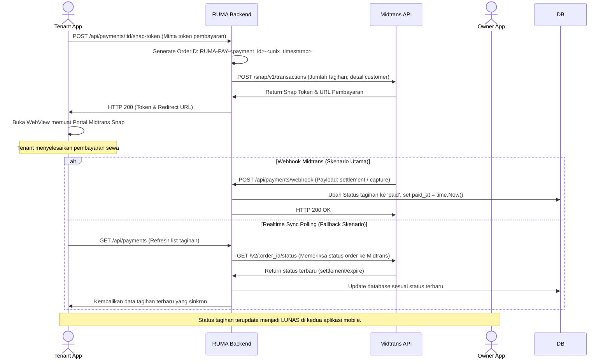
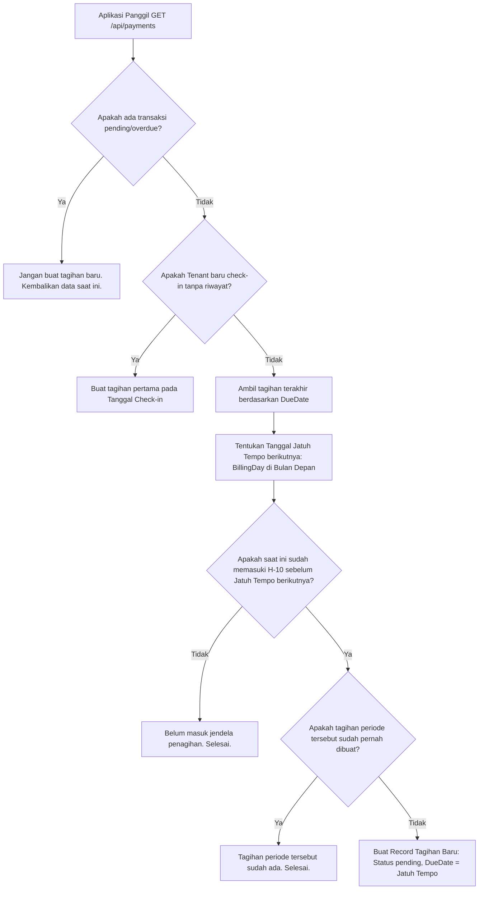

# 🏠 RUMA - Sistem Manajemen Kos Modern (Owner & Tenant)

RUMA adalah ekosistem manajemen kos (boarding house) terintegrasi yang dirancang untuk menjembatani interaksi antara Pemilik Kos (Owner/Ibu Kos) dan Penghuni Kos (Tenant/Anak Kos). Proyek ini menggunakan arsitektur modern berkinerja tinggi berbasis **Golang (Backend)** dan **Flutter (Mobile Frontend)**, serta terintegrasi langsung dengan **Midtrans Payment Gateway (Sandbox)** untuk pembayaran otomatis yang aman.

---

## 📂 Struktur Repositori & Dokumentasi Terpisah

Proyek RUMA dibagi menjadi tiga komponen utama yang memiliki dokumentasi khusus masing-masing:

### 1. [🏠 RUMA Owner App (Flutter)](./rumaowner/README.md)
Aplikasi mobile khusus pemilik kos untuk mengelola properti, kamar, pendaftaran penghuni (tenant), pengumuman, pengeluaran operasional, manual payment confirmation, serta melihat analisis laporan keuangan (pendapatan, pengeluaran, laba bersih).
*   **Selengkapnya:** [Baca Dokumentasi Owner App](./rumaowner/README.md)

### 2. [🔑 RUMA Tenant App (Flutter)](./rumatenant/README.md)
Aplikasi mobile khusus penghuni kos untuk memantau status sewa kamar, membayar tagihan secara langsung dengan WebView Midtrans Snap, meminta token Snaps, mengajukan komplain kerusakan dengan foto bukti, serta memantau pengumuman kos.
*   **Selengkapnya:** [Baca Dokumentasi Tenant App](./rumatenant/README.md)

### 3. [⚡ RUMA Backend API (Golang)](./backend/README.md)
REST API service menggunakan Gin Gonic, GORM ORM, PostgreSQL database, dan integrasi Midtrans Sandbox Engine. Bertanggung jawab atas seluruh logika bisnis sistem.

---

## 🏗️ Arsitektur Sistem Global

```text
                               +-----------------------------+
                               |     Midtrans PG (Sandbox)   |
                               +--------------+--------------+
                                              ^
                             (API Snap Token) | (Webhook Notification)
                                              v
+------------------+           +--------------+--------------+           +------------------+
|                  |  REST API |                             |  REST API |                  |
|    RUMA Owner    +---------->|        RUMA Backend         |<----------+   RUMA Tenant    |
|   (Flutter App)  |<----------+        (Golang API)         +---------->|  (Flutter App)   |
|                  |  JWT Auth |                             |  JWT Auth |                  |
+------------------+           +--------------+--------------+           +------------------+
                                              |
                                              | GORM ORM
                                              v
                               +--------------+--------------+
                               |     PostgreSQL Database     |
                               +-----------------------------+
```

---

## 📊 Skema Database Bersama (PostgreSQL)

Seluruh entitas database RUMA dikelola menggunakan **GORM Auto-Migration** pada database **PostgreSQL**:

*   **`users`**: Menyimpan kredensial dan profil user dengan peran (`superadmin`, `owner`, `admin`, `tenant`).
*   **`boarding_houses`**: Menyimpan nama kos, alamat, galeri foto, dan harga default kamar milik owner.
*   **`rooms`**: Kamar-kamar kos yang terhubung ke properti kos beserta harga sewa dan status ketersediaan (`available`, `occupied`, `maintenance`).
*   **`tenants`**: Relasi penempatan penghuni (`users`) ke dalam kamar (`rooms`) lengkap dengan tanggal check-in dan tanggal jatuh tempo sewa (`billing_day`).
*   **`payments`**: Pencatatan tagihan sewa per periode (bulan) beserta status sewa (`pending`, `paid`, `overdue`, `cancelled`) dan ID transaksi Midtrans (`midtrans_order_id`).
*   **`expenses`**: Pencatatan manual pengeluaran operasional oleh pemilik kos untuk kebutuhan rugi/laba.
*   **`complaints`**: Pelaporan keluhan fasilitas dari tenant dilengkapi foto bukti dan status perbaikan (`pending`, `in_progress`, `resolved`).
*   **`announcements`**: Pengumuman publik dari pemilik kos dengan ikon visual (`water`, `electric`, `repair`, `info`).

---

## 🔄 Alur Logika Sistem Utama (Global Flows)

### 1. Pembayaran Tagihan Terintegrasi Midtrans (Snap & Webhook)
Alur transaksi sewa kamar dari inisiasi di aplikasi tenant hingga status lunas terkonfirmasi oleh server:



### 2. Siklus Penagihan Otomatis (`EnsureNextBillGenerated`)
Pembangkitan tagihan bulanan dilakukan secara asinkron dan dinamis pada backend setiap kali list pembayaran diakses, menghindari kompleksitas sistem cronjob eksternal:



---

## ⚙️ Konfigurasi Environment & Startup Cepat

### 1. Konfigurasi Backend (`backend/.env`)
```env
APP_PORT=8080
DB_HOST=postgres
DB_PORT=5432
DB_USER=postgres
DB_PASSWORD=postgres
DB_NAME=kosdb
JWT_SECRET=supersecretkeyandauntukjwttoken2026
MIDTRANS_SERVER_KEY=SB-Mid-server-Jw5gV97y0u-0H1x2z3Y4W5V6
```

### 2. Cara Menjalankan Backend & DB
```bash
# Menyalakan PostgreSQL & Go Server via Docker Compose
docker compose up --build
```

### 3. Cara Menjalankan Aplikasi Mobile
Gunakan script `start.sh` di root direktori untuk kemudahan koneksi otomatis IP komputer lokal ke perangkat uji:
```bash
# Jalankan Owner App
./start.sh owner

# Jalankan Tenant App
./start.sh tenant
```

---

## 👨‍💻 Lisensi & Hubungi Kami

Proyek ini berada di bawah lisensi **MIT**. Untuk kontribusi kode atau laporan bug sistem, silakan buat Pull Request atau buka Github Issue pada repositori ini.
